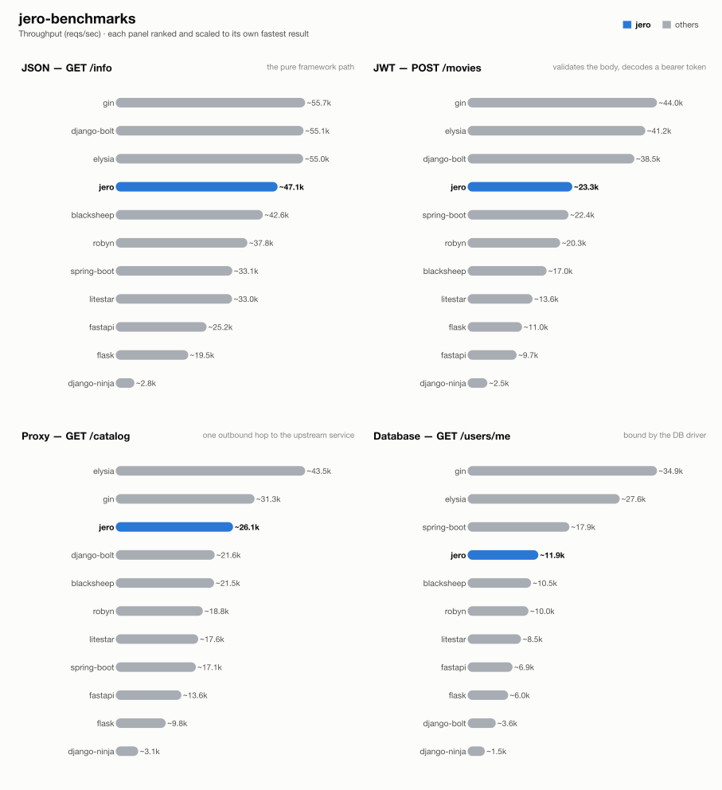

# jero-benchmarks — run `20260814T145537`

_Generated 2026-08-15T19:36:29+00:00_

## Run configuration

| | |
| --- | --- |
| **Run ID** | `20260814T145537` |
| **Created** | 2026-08-14 14:55:37 UTC |
| **Host** | ip-172-31-31-98.eu-central-1.compute.internal |
| **AWS region** | eu-central-1 |
| **EC2 instance type** | c9g.2xlarge |
| **EC2 AMI** | `ami-01dc90482139bd24f` |
| **k6 VUs** | 128 |
| **Duration per attempt** | 60s |
| **Best of** | 3 |
| **Server workers** | 1 |
| **Python server** | granian |
| **Frameworks** | blacksheep, django-bolt, django-ninja, elysia, fastapi, flask, gin, jero, litestar, robyn, spring-boot |
| **Results backend** | postgres://ep-cool-waterfall-za6sh01t-pooler.c-2.eu-west-2.aws.neon.tech/neondb |

## Results



### 1 - GET /info

| Framework | req/s | vs | mean | vs | p99 | vs | succ% | memPk | memAv | cpuAv | cpuPk | cpu ~ | mem ~ |
| --- | --- | --- | --- | --- | --- | --- | --- | --- | --- | --- | --- | --- | --- |
| gin | ~55.7k | x1.18 | 2.20ms | x1.21 | 9.75ms | x1.19 | 100.00 | 13M | 12M | 68% | 77% | ▅▆▆▇▇▇▇▇▇▇▇▇█▇▇▄ | █▇▇▇▇▇▇▇▇▇▇▇▇▇▇▇ |
| django-bolt | ~55.1k | x1.17 | 2.24ms | x1.19 | 10.57ms | x1.10 | 100.00 | 84M | 80M | 83% | 94% | ▆▆▇▇▇▇▇▇▇▇▇█▇▇▇▄ | ▇▇▇▇▇▇▇▇▇▇▇▇█▇▇▇ |
| elysia | ~55.0k | x1.17 | 2.23ms | x1.19 | 9.91ms | x1.17 | 100.00 | 57M | 55M | 44% | 50% | ▆▆▆▆▇▇▇▇▇▇▇█▇▇▇▄ | ▇▇▇▇▇▇▇▇▇▇▇█▇▇▇▇ |
| jero | ~47.1k | x1.00 | 2.66ms | x1.00 | 11.61ms | x1.00 | 100.00 | 90M | 87M | 90% | 97% | ▇▇▇▇▇▇▇▇▇▇▇▇▇█▇▄ | ▇▇▇▇▇▇▇▇▇▇▇▇█▇▇▇ |
| blacksheep | ~42.6k | x0.90 | 2.96ms | x0.90 | 11.32ms | x1.03 | 100.00 | 75M | 74M | 92% | 98% | ▆▇▇▇▇▇▇▇▇▇▇▇▇█▇▄ | ▇▇▇▇▇▇▇▇▇▇▇█▇▇▇▇ |
| robyn | ~37.8k | x0.80 | 3.32ms | x0.80 | 12.25ms | x0.95 | 100.00 | 58M | 51M | 94% | 101% | ▆▇▇▇▇▇▇▇▇▇▇▇▇▇█▄ | ▇▇▇▇▇▇▇▇█▇▇▇▇▇▇▇ |
| spring-boot | ~33.1k | x0.70 | 3.80ms | x0.70 | 12.13ms | x0.96 | 100.00 | 595M | 593M | 94% | 100% | ▇▇▇▇▇▇▇▇▇▇▇▇▇▇█▄ | ▇▇▇▇█▇▇▇▇▇▇▇▇▇▇▇ |
| litestar | ~33.0k | x0.70 | 3.84ms | x0.69 | 12.25ms | x0.95 | 100.00 | 83M | 79M | 95% | 101% | ▆▇▇▇▇▇▇▇▇▇▇█▇▇▇▄ | █▇▇▇▇▇▇▇▇▇▇▇▇▇▇▇ |
| fastapi | ~25.2k | x0.53 | 5.06ms | x0.53 | 13.35ms | x0.87 | 100.00 | 80M | 76M | 97% | 102% | ▇▇▇▇▇▇▇▇▇▇▇▇▇█▇▄ | ▇█▇▇▇▇▇▇▇▇▇▇▇▇▇▇ |
| flask | ~19.5k | x0.41 | 6.53ms | x0.41 | 15.90ms | x0.73 | 100.00 | 84M | 79M | 102% | 103% | ▇▇▇▇▇▇▇▇█▇▇▇▇▇▇▇ | ▇▇▇▇▇▇▇▇▇▇█▇▇▇▇▇ |
| django-ninja | ~2.8k | x0.06 | 45.21ms | x0.06 | 73.35ms | x0.16 | 100.00 | 122M | 115M | 99% | 100% | ▇▇▇█▇▇▇▇▇▇▇▇▇▇▇▇ | ▇▇▇▇▇▇▇▇▇▇▇▇█▇▇▇ |

### 2 - POST /movies (JWT)

| Framework | req/s | vs | mean | vs | p99 | vs | succ% | memPk | memAv | cpuAv | cpuPk | cpu ~ | mem ~ |
| --- | --- | --- | --- | --- | --- | --- | --- | --- | --- | --- | --- | --- | --- |
| gin | ~44.0k | x1.89 | 2.72ms | x1.99 | 12.02ms | x1.42 | 100.00 | 13M | 12M | 80% | 90% | ▆▆▆▇▇▇▇▇▇▇▇▇▇▇█▄ | ▇▇▇█▇▇▇▇▇▇▇▇▇▇▇▆ |
| elysia | ~41.2k | x1.77 | 3.00ms | x1.81 | 12.80ms | x1.33 | 100.00 | 93M | 87M | 86% | 96% | ▆▆▇▇▇▇▇▇▇▇▇▇▇▇█▄ | ▇▇▇▇▇▇▇▇▇█▇▇▇▇▇▇ |
| django-bolt | ~38.5k | x1.65 | 3.21ms | x1.69 | 13.03ms | x1.31 | 100.00 | 88M | 81M | 88% | 98% | ▆▆▇▇▇▇▇▇▇▇▇▇▇▇█▄ | ▇▇▇▇▇▇▇▇▇█▇▇▇▇▇▇ |
| jero | ~23.3k | x1.00 | 5.42ms | x1.00 | 17.02ms | x1.00 | 100.00 | 98M | 89M | 95% | 100% | ▇▇▇▇▇▇▇▇▇▇▇▇█▇▇▄ | ▇▇▇▇█▇▇▇▇▇▇▇▇▇▇▇ |
| spring-boot | ~22.4k | x0.96 | 5.65ms | x0.96 | 15.18ms | x1.12 | 100.00 | 610M | 608M | 96% | 101% | ▇▇▇▇▇▇▇▇▇▇▇█▇▇▇▄ | ▇▇▇▇▇▇▇▇▇▇▇█▇▇▇▇ |
| robyn | ~20.3k | x0.87 | 6.25ms | x0.87 | 16.40ms | x1.04 | 100.00 | 60M | 51M | 101% | 102% | ▇▇▇▇▇▇▇▇█▇▇▇▇▇▇▇ | ▇▇▇▇▇▇▇▇▇▇▇█▇▇▇▇ |
| blacksheep | ~17.0k | x0.73 | 7.49ms | x0.72 | 17.29ms | x0.98 | 100.00 | 83M | 76M | 100% | 102% | ▇▇▇▇▇▇▇▇█▇▇▇▇▇▇▇ | ▇▇▇▇▇▇▇▇▇▇▇▇█▇▇▇ |
| litestar | ~13.6k | x0.58 | 9.37ms | x0.58 | 19.78ms | x0.86 | 100.00 | 92M | 81M | 100% | 102% | ▇▇▇▇▇▇▇▇▇▇█▇▇▇▇▇ | ▇▇▇▇▇▇▇█▇▇▇▇▇▇▇▇ |
| flask | ~11.0k | x0.47 | 11.59ms | x0.47 | 20.72ms | x0.82 | 100.00 | 80M | 79M | 98% | 103% | ▇▇▇▇▇█▇▇▇▇▇▇▇▇▇▄ | █▇▇▇▇▇▇▇▇▇▇▇▇▇▇▇ |
| fastapi | ~9.7k | x0.41 | 13.20ms | x0.41 | 25.40ms | x0.67 | 100.00 | 86M | 79M | 101% | 103% | ▇▇▇▇▇▇▇▇█▇▇▇▇▇▇▇ | ▇▇▇█▇▇▇▇▇▇▇▇▇▇▇▇ |
| django-ninja | ~2.5k | x0.11 | 50.97ms | x0.11 | 79.71ms | x0.21 | 100.00 | 119M | 114M | 99% | 100% | ▇▇▇▇▇▇▇▇▇▇▇▇█▇▇▇ | ▇▇▇▇▇▇▇▇▇▇█▇▇▇▇▇ |

### 3 - GET proxy (upstream)

| Framework | req/s | vs | mean | vs | p99 | vs | succ% | memPk | memAv | cpuAv | cpuPk | cpu ~ | mem ~ |
| --- | --- | --- | --- | --- | --- | --- | --- | --- | --- | --- | --- | --- | --- |
| elysia | ~43.5k | x1.67 | 2.85ms | x1.71 | 11.82ms | x1.17 | 100.00 | 100M | 91M | 89% | 98% | ▆▆▇▇▇▇▇▇▇▇▇█▇▇▇▄ | ▇▇▇▇▇▇▇▇▇▇▇▇▇▇█▇ |
| gin | ~31.3k | x1.20 | 4.00ms | x1.22 | 12.78ms | x1.08 | 100.00 | 17M | 16M | 94% | 100% | ▇▇▇▇▇▇▇▇█▇▇▇▇▇▇▄ | ▇▇▇▇▇█▇▇▇▇▇▇▇▇▇▇ |
| jero | ~26.1k | x1.00 | 4.86ms | x1.00 | 13.81ms | x1.00 | 100.00 | 119M | 110M | 96% | 102% | ▇▇▇▇▇▇▇▇▇▇▇▇▇▇█▄ | ▇▇▇▇▇▇█▇▇▇▇▇▇▇▇▇ |
| django-bolt | ~21.6k | x0.83 | 5.88ms | x0.83 | 14.64ms | x0.94 | 100.00 | 107M | 102M | 98% | 103% | █▇▇▇▇▇▇▇▇▇▇▇▇▇▇▄ | ▇█▇▇▇▇▇▇▇▇▇▇▇▇▇▇ |
| blacksheep | ~21.5k | x0.82 | 5.92ms | x0.82 | 14.90ms | x0.93 | 100.00 | 105M | 95M | 97% | 102% | ▇▇▇▇▇█▇▇▇▇▇▇▇▇▇▄ | ▇▇▇▇▇█▇▇▇▇▇▇▇▇▇▇ |
| robyn | ~18.8k | x0.72 | 6.79ms | x0.72 | 15.30ms | x0.90 | 100.00 | 73M | 66M | 96% | 101% | ▇▇▇▇▇▇▇▇▇▇█▇▇▇▇▄ | ▇▇▇█▇▇▇▇▇▇▇▇▇▇▇▇ |
| litestar | ~17.6k | x0.68 | 7.22ms | x0.67 | 17.59ms | x0.78 | 100.00 | 106M | 97M | 101% | 103% | ▇▇▇▇▇▇▇▇█▇▇▇▇▇▇▇ | ▇▇▇▇▇▇▇▇▇▇▇▇▇▇█▇ |
| spring-boot | ~17.1k | x0.66 | 7.45ms | x0.65 | 14.19ms | x0.97 | 100.00 | 639M | 637M | 100% | 102% | ▇▇▇▇▇▇▇▇▇▇▇▇▇▇█▇ | ▇▇▇█▇▇▇▇▇▇▇▇▇▇▇▇ |
| fastapi | ~13.6k | x0.52 | 9.41ms | x0.52 | 20.67ms | x0.67 | 100.00 | 99M | 92M | 98% | 102% | ▇▇█▇▇▇▇▇▇▇▇▇▇▇▇▄ | ▇▇▇▇▇▇▇█▇▇▇▇▇▇▇▇ |
| flask | ~9.8k | x0.37 | 13.06ms | x0.37 | 20.95ms | x0.66 | 100.00 | 89M | 82M | 99% | 100% | ▇▇▇▇▇▇▇▇█▇▇▇▇▇▇▇ | ▇▇█▇▇▇▇▇▇▇▇▇▇▇▇▇ |
| django-ninja | ~3.1k | x0.12 | 40.85ms | x0.12 | 69.07ms | x0.20 | 100.00 | 143M | 133M | 99% | 100% | ▇▇▇▇▇▇▇▇▇█▇▇▇▇▇▇ | ▇█▇▇▇▇▇▇▇▇▇▇▇▇▇▇ |

### 4 - GET /users/me (DB)

| Framework | req/s | vs | mean | vs | p99 | vs | succ% | memPk | memAv | cpuAv | cpuPk | cpu ~ | mem ~ |
| --- | --- | --- | --- | --- | --- | --- | --- | --- | --- | --- | --- | --- | --- |
| gin | ~34.9k | x2.94 | 3.55ms | x3.03 | 13.05ms | x1.49 | 100.00 | 31M | 30M | 90% | 99% | ▇▇▇▇▇▇▇▇▇▇▇▇▇▇█▄ | █▇▇▇▇▇▇▇▇▇▇▇▇▇▇▇ |
| elysia | ~27.6k | x2.33 | 4.56ms | x2.36 | 13.96ms | x1.39 | 100.00 | 118M | 113M | 94% | 101% | ▇▇▇▇▇▇▇▇▇▇▇▇▇█▇▄ | ▇▇▇▇▇▇▇▇█▇▇▇▇▇▇▇ |
| spring-boot | ~17.9k | x1.51 | 7.11ms | x1.51 | 15.61ms | x1.24 | 100.00 | 652M | 650M | 96% | 102% | ▇▇▇▇▇▇▇▇▇▇█▇▇▇▇▄ | ▇▇▇▇▇▇▇▇▇▇▇▇▇▇█▇ |
| jero | ~11.9k | x1.00 | 10.75ms | x1.00 | 19.38ms | x1.00 | 100.00 | 116M | 106M | 101% | 103% | ▇▇▇▇▇█▇▇▇▇▇▇▇▇▇▇ | ▇▇▇▇▇▇▇█▇▇▇▇▇▇▇▇ |
| blacksheep | ~10.5k | x0.88 | 12.18ms | x0.88 | 21.62ms | x0.90 | 100.00 | 102M | 94M | 98% | 103% | ▇█▇▇▇▇▇▇▇▇▇▇▇▇▇▄ | ▇▇▇▇▇▇▇▇▇▇▇▇▇▇█▇ |
| robyn | ~10.0k | x0.84 | 12.81ms | x0.84 | 22.38ms | x0.87 | 100.00 | 74M | 66M | 98% | 104% | ▇▇▇▇▇▇▇▇▇▇▇█▇▇▇▄ | ▇▇▇▇▇█▇▇▇▇▇▇▇▇▇▇ |
| litestar | ~8.5k | x0.72 | 15.00ms | x0.72 | 26.86ms | x0.72 | 100.00 | 100M | 94M | 97% | 102% | ▇▇▇▇▇█▇▇▇▇▇▇▇▇▇▄ | ▇▇▇▇▇▇▇▇▇▇▇▇▇▇▇█ |
| fastapi | ~6.9k | x0.58 | 18.58ms | x0.58 | 33.29ms | x0.58 | 100.00 | 94M | 92M | 96% | 102% | ▇▇▇▇▇▇▇▇█▇▇▇▇▇▇▄ | █▇▇▇▇▇▇▇▇▇▇▇▇▇▇▇ |
| flask | ~6.0k | x0.51 | 21.19ms | x0.51 | 39.63ms | x0.49 | 100.00 | 82M | 81M | 88% | 89% | ▇▇▇▇▇▇▇▇▇▇▇▇▇█▇▇ | ▇▇▇▇▇▇▇▇█▇▇▇▇▇▇▇ |
| django-bolt | ~3.6k | x0.30 | 35.36ms | x0.30 | 59.82ms | x0.32 | 100.00 | 113M | 106M | 94% | 98% | ▇▇▇▇▇▇█▇▇▇▇▇▇▇▇▄ | ▇▇▇▇▇▇▇▇▇▇▇▇▇▇█▇ |
| django-ninja | ~1.5k | x0.13 | 85.16ms | x0.13 | 126.36ms | x0.15 | 100.00 | 144M | 135M | 99% | 101% | ▇▇▇▇▇▇▇█▇▇▇▇▇▇▇▇ | ▇▇▇▇▇█▇▇▇▇▇▇▇▇▇▇ |

## How these results were made

**Isolation.** Exactly one framework container is ever alive at a time, alongside
the shared Postgres/upstream/k6-runner infra -- brought up via `compose.base.yml`
plus that framework's own `compose.<fw>.yml`, torn down before the next framework
starts. No two frameworks ever share a core or contend for host resources.

**One worker, one core.** Every service runs exactly 1 worker (granian
`--workers 1`, Gin `GOMAXPROCS=1`, Bun's single JS thread, Bolt `--processes 1`),
pinned to one dedicated CPU core via `cpuset` affinity -- not a CFS quota, which
throttles a saturated container every 100ms scheduler period and adds
tail-latency stalls; affinity confines all of a framework's threads (including
GIL-releasing extensions like `msgspec`/`psqlpy`) to one core with no such stalls.

**Equal resource budgets.** DB pool and outbound-HTTP pool are capped at **64**
connections for every framework/language.

**Best of N.** Each (framework, test) pair runs multiple attempts; the
best-scoring attempt is kept. Score equally weights throughput and latency,
each normalized against that test's best attempt:

```
score = reqsPerSec/maxReqs + minMean/mean + minP99/p99
```

**Resource-use columns.** `memPk`/`memAv` = peak/average resident memory (MB);
`cpuAv`/`cpuPk` = average/peak CPU as % of one core (pinned via `cpuset`, so
these sit ≤100%); `cpu ~`/`mem ~` = a 0-to-max-scaled sparkline of the CPU/memory
time series during the attempt. Only the framework's own container is measured
-- Postgres and the upstream are excluded.

**Equal work, per test** -- every framework does the same task; only the
*native* tool differs:

| Framework | Language | Server | HTTP client | DB driver | Validates body (test 2) | Parses upstream (test 3) | JSON serializer |
| --- | --- | --- | --- | --- | --- | --- | --- |
| blacksheep | Python 3.13 | granian ASGI | pyreqwest | psqlpy | dataclass bind | passthrough dict | orjson |
| django-bolt | Python 3.13 | built-in Rust server | pyreqwest | psycopg (Django ORM) | msgspec Struct | passthrough bytes | msgspec |
| django-ninja | Python 3.13 | granian ASGI | pyreqwest | psycopg (Django ORM) | pydantic (Schema) | passthrough bytes | pydantic |
| elysia | Bun / TS | Bun native | fetch | Bun SQL | typebox schema | passthrough object | Bun native |
| fastapi | Python 3.13 | granian ASGI | pyreqwest | psqlpy | pydantic | typed (pydantic) + response-model re-validate | pydantic |
| flask | Python 3.13 | granian WSGI | pyreqwest (sync) | psycopg | pydantic | typed (pydantic) | stdlib json |
| gin | Go | net/http (GOMAXPROCS=1) | net/http | pgx | ShouldBindJSON struct | typed struct | encoding/json |
| jero | Python 3.13 | granian ASGI | pyreqwest | psqlpy | msgspec Struct | typed (msgspec) | msgspec |
| litestar | Python 3.13 | granian ASGI | pyreqwest | psqlpy | msgspec Struct | typed (msgspec) | msgspec |
| robyn | Python 3.13 | built-in Rust server | pyreqwest | psqlpy | pydantic (native param) | typed (pydantic) | stdlib json / pydantic |
| spring-boot | Java 25 | embedded Tomcat, virtual threads | RestClient (Apache HttpClient5) | JdbcTemplate (HikariCP) | jakarta bean validation (record) | typed (Jackson) | Jackson |

**Known, intended differences** (each framework's real idiomatic behaviour, kept
rather than normalised away): the JSON serializer column (stdlib `json` is
slower than msgspec/orjson/native); FastAPI additionally re-validates the
*response* against its `response_model`; Blacksheep/Elysia/Django Ninja/Django
Bolt return the upstream payload straight through as bytes/dict; the two Django
frameworks return snake_case field names where the rest of the Python fleet
returns camelCase; Spring Boot's Jackson binding coerces a numeric field given
as a JSON string rather than rejecting it like pydantic/msgspec do. These are
visible here so a number is never mistaken for pure framework speed.

## Disclosure

The author of this benchmark suite is also the author of [jero](https://pypi.org/project/jero/), one of the frameworks benchmarked here. Every measure above -- equal resource budgets, idiomatic code per framework, isolated single-framework runs, documented intended differences -- applies identically to jero and everyone else; nothing here is tuned in its favor.

---
_Generated by `export_results.py` from `results.is_best` rows in postgres://ep-cool-waterfall-za6sh01t-pooler.c-2.eu-west-2.aws.neon.tech/neondb._