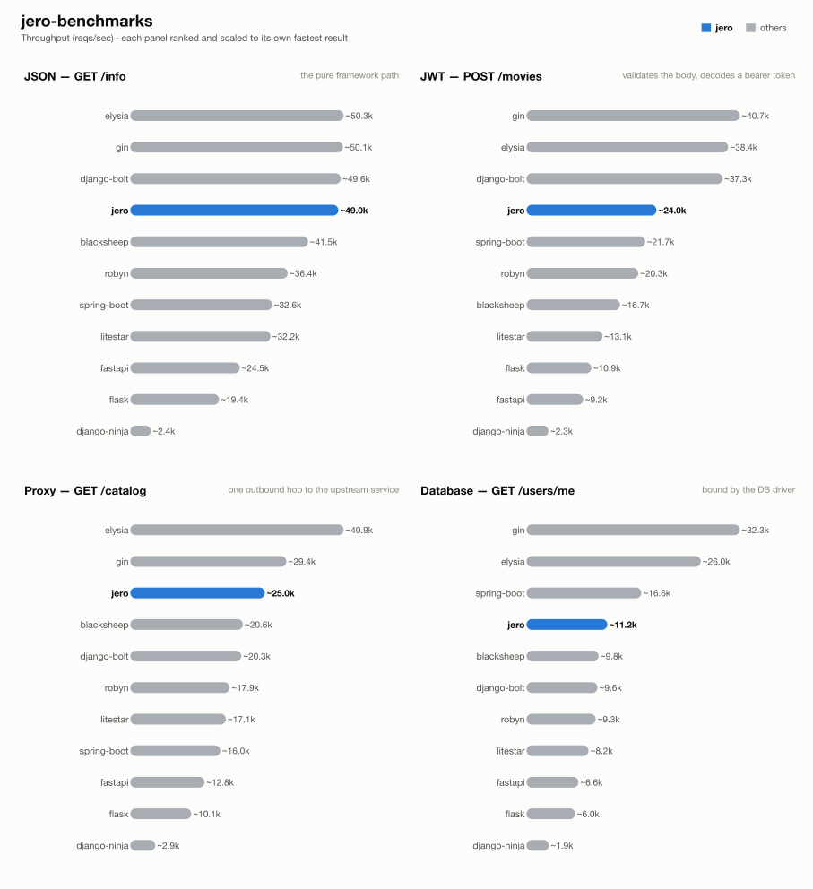

# jero-benchmarks — run `20260817T123220`

_Generated 2026-08-17T14:56:35+00:00_

## Run configuration

| | |
| --- | --- |
| **Run ID** | `20260817T123220` |
| **Created** | 2026-08-17 12:33:30 UTC |
| **Host** | ip-172-31-26-133.eu-central-1.compute.internal |
| **AWS region** | eu-central-1 |
| **EC2 instance type** | c9g.2xlarge |
| **EC2 AMI** | `ami-0f7d895aa37851cb2` |
| **k6 VUs** | 128 |
| **Duration per attempt** | 60s |
| **Best of** | 3 |
| **Server workers** | 1 |
| **Python server** | granian |
| **Event loop** | uvloop |
| **Frameworks** | blacksheep, django-bolt, django-ninja, elysia, fastapi, flask, gin, jero, litestar, robyn, spring-boot |
| **Results backend** | postgres://ep-cool-waterfall-za6sh01t-pooler.c-2.eu-west-2.aws.neon.tech/neondb |

## Results

### 1 - GET /info

| Framework | req/s | vs | mean | vs | p99 | vs | succ% | memPk | memAv | cpuAv | cpuPk | cpu ~ | mem ~ |
| --- | --- | --- | --- | --- | --- | --- | --- | --- | --- | --- | --- | --- | --- |
| elysia | ~50.3k | x1.03 | 2.42ms | x1.06 | 10.88ms | x1.01 | 100.00 | 59M | 55M | 41% | 47% | ▅▆▆▆▇▇▇▇▇▇▇▇▇▇█▄ | █▇▇▇▇▇▇▇▇▇▇▇▇▇▇▇ |
| gin | ~50.1k | x1.02 | 2.43ms | x1.05 | 10.90ms | x1.01 | 100.00 | 13M | 12M | 65% | 72% | ▆▆▆▇▇▇▇▇▇▇▇▇▇▇█▄ | ▇▇▇▇▇█▇▇▇▇▇▇▇▇▇▇ |
| django-bolt | ~49.6k | x1.01 | 2.46ms | x1.04 | 11.47ms | x0.96 | 100.00 | 90M | 79M | 78% | 88% | ▅▆▆▇▇▇▇▇▇▇▇▇▇▇█▄ | █▇▇▇▇▇▇▇▇▇▇▇▇▇▇▇ |
| jero | ~49.0k | x1.00 | 2.56ms | x1.00 | 10.99ms | x1.00 | 100.00 | 81M | 80M | 90% | 98% | ▇▇▇▇▇▇▇▇▇▇▇▇█▇▇▄ | █▇▇▇▇▇▇▇▇▇▇▇▇▇▇▇ |
| blacksheep | ~41.5k | x0.85 | 3.03ms | x0.84 | 12.05ms | x0.91 | 100.00 | 84M | 73M | 92% | 99% | ▇▇▇▇▇▇▇▇▇▇▇█▇▇▇▄ | ▇▇▇▇█▇▇▇▇▇▇▇▇▇▇▇ |
| robyn | ~36.4k | x0.74 | 3.43ms | x0.75 | 12.86ms | x0.85 | 100.00 | 52M | 50M | 93% | 102% | ▆▇▇▇▇▇▇▇▇▇▇▇▇█▇▄ | █▇▇▇▇▇▇▇▇▇▇▇▇▇▇▇ |
| spring-boot | ~32.6k | x0.66 | 3.85ms | x0.66 | 12.84ms | x0.86 | 100.00 | 616M | 615M | 93% | 100% | ▇▇▇▇▇▇▇▇▇▇▇█▇▇▇▄ | █▇▇▇▇▇▇▇▇▇▇▇▇▇▇▇ |
| litestar | ~32.2k | x0.66 | 3.94ms | x0.65 | 12.86ms | x0.85 | 100.00 | 83M | 77M | 95% | 101% | ▇▇▇▇▇▇▇▇▇▇▇▇▇█▇▄ | ▇▇▇▇▇▇▇▇▇█▇▇▇▇▇▇ |
| fastapi | ~24.5k | x0.50 | 5.19ms | x0.49 | 14.27ms | x0.77 | 100.00 | 85M | 75M | 95% | 100% | ▇▇▇▇▇▇▇▇█▇▇▇▇▇▇▄ | ▇▇▇▇▇▇▇▇█▇▇▇▇▇▇▇ |
| flask | ~19.4k | x0.40 | 6.57ms | x0.39 | 16.82ms | x0.65 | 100.00 | 84M | 78M | 101% | 103% | ▇▇▇▇▇▇▇█▇▇▇▇▇▇▇▇ | ▇▇▇▇▇▇▇▇▇█▇▇▇▇▇▇ |
| django-ninja | ~2.4k | x0.05 | 52.70ms | x0.05 | 96.01ms | x0.11 | 100.00 | 120M | 115M | 99% | 100% | ▇▇▇▇▇▇▇▇▇▇▇█▇▇▇▇ | █▇▇▇▇▇▇▇▇▇▇▇▇▇▇▇ |

### 2 - POST /movies (JWT)

| Framework | req/s | vs | mean | vs | p99 | vs | succ% | memPk | memAv | cpuAv | cpuPk | cpu ~ | mem ~ |
| --- | --- | --- | --- | --- | --- | --- | --- | --- | --- | --- | --- | --- | --- |
| gin | ~40.7k | x1.70 | 2.91ms | x1.81 | 13.04ms | x1.26 | 100.00 | 14M | 12M | 77% | 88% | ▆▆▆▇▇▇▇▇▇▇▇▇▇▇█▄ | ▇▇▇▇▇▇▇▇█▇▇▇▇▇▇▇ |
| elysia | ~38.4k | x1.60 | 3.20ms | x1.65 | 13.56ms | x1.22 | 100.00 | 89M | 82M | 85% | 94% | ▆▆▇▇▇▇▇▇▇▇▇▇▇▇█▄ | ▆▇▇▇▇▇▇▇▇▇▇▇█▇▇▇ |
| django-bolt | ~37.3k | x1.55 | 3.28ms | x1.60 | 13.84ms | x1.19 | 100.00 | 90M | 80M | 86% | 95% | ▆▆▇▇▇▇▇▇▇▇▇▇▇█▇▄ | ▇▇▇▇▇▇▇▇▇▇▇▇▇█▇▇ |
| jero | ~24.0k | x1.00 | 5.27ms | x1.00 | 16.50ms | x1.00 | 100.00 | 90M | 81M | 95% | 101% | ▇▇▇▇▇▇▇▇▇▇▇▇█▇▇▄ | ▇▇▇▇▇▇▇▇▇█▇▇▇▇▇▇ |
| spring-boot | ~21.7k | x0.90 | 5.80ms | x0.91 | 16.94ms | x0.97 | 100.00 | 629M | 628M | 98% | 100% | ▇▇▇▇▇▇▇█▇▇▇▇▇▇▇▇ | ▇▇▇▇▇▇▇▇▇▇▇█▇▇▇▇ |
| robyn | ~20.3k | x0.85 | 6.24ms | x0.84 | 16.48ms | x1.00 | 100.00 | 61M | 50M | 96% | 100% | ▇▇▇▇▇▇▇▇▇▇▇▇█▇▇▄ | ▇▇▇▇▇▇▇▇▇█▇▇▇▇▇▇ |
| blacksheep | ~16.7k | x0.69 | 7.63ms | x0.69 | 18.47ms | x0.89 | 100.00 | 77M | 74M | 100% | 103% | █▇▇▇▇▇▇▇▇▇▇▇▇▇▇▇ | ▇▇▇▇▇▇▇█▇▇▇▇▇▇▇▇ |
| litestar | ~13.1k | x0.55 | 9.71ms | x0.54 | 21.09ms | x0.78 | 100.00 | 90M | 79M | 101% | 105% | █▇▇▇▇▇▇▇▇▇▇▇▇▇▇▇ | ▇▇▇▇▇▇▇▇▇▇▇▇▇█▇▇ |
| flask | ~10.9k | x0.45 | 11.70ms | x0.45 | 21.06ms | x0.78 | 100.00 | 89M | 78M | 98% | 104% | ▇▇▇▇█▇▇▇▇▇▇▇▇▇▇▄ | ▇▇█▇▇▇▇▇▇▇▇▇▇▇▇▇ |
| fastapi | ~9.2k | x0.39 | 13.80ms | x0.38 | 28.49ms | x0.58 | 100.00 | 87M | 77M | 98% | 102% | ▇▇▇▇▇▇▇▇▇█▇▇▇▇▇▄ | ▇▇▇█▇▇▇▇▇▇▇▇▇▇▇▇ |
| django-ninja | ~2.3k | x0.09 | 56.42ms | x0.09 | 104.20ms | x0.16 | 100.00 | 124M | 116M | 99% | 100% | ▇▇▇█▇▇▇▇▇▇▇▇▇▇▇▇ | ▇▇▇▇▇▇▇▇▇█▇▇▇▇▇▇ |

### 3 - GET proxy (upstream)

| Framework | req/s | vs | mean | vs | p99 | vs | succ% | memPk | memAv | cpuAv | cpuPk | cpu ~ | mem ~ |
| --- | --- | --- | --- | --- | --- | --- | --- | --- | --- | --- | --- | --- | --- |
| elysia | ~40.9k | x1.64 | 3.02ms | x1.67 | 12.85ms | x1.18 | 100.00 | 92M | 87M | 87% | 98% | ▆▆▇▇▇▇▇▇▇▇▇▇█▇▇▄ | ▇▇▇▇▇▇▇▇▇▇▇▇▇█▇▇ |
| gin | ~29.4k | x1.17 | 4.24ms | x1.19 | 13.91ms | x1.09 | 100.00 | 17M | 16M | 93% | 99% | ▇▇▇▇▇▇▇▇▇▇▇▇▇▇█▄ | ▇▇▇▇▇▇▇▇█▇▇▇▇▇▇▇ |
| jero | ~25.0k | x1.00 | 5.06ms | x1.00 | 15.12ms | x1.00 | 100.00 | 110M | 102M | 96% | 102% | ▇▇▇▇▇▇▇▇▇▇▇▇█▇▇▄ | ▇▇▇▇█▇▇▇▇▇▇▇▇▇▇▇ |
| blacksheep | ~20.6k | x0.82 | 6.17ms | x0.82 | 16.47ms | x0.92 | 100.00 | 100M | 89M | 97% | 103% | ▇▇▇▇▇▇▇▇▇▇▇▇▇▇█▄ | ▇▇▇▇▇▇▇▇▇█▇▇▇▇▇▇ |
| django-bolt | ~20.3k | x0.81 | 6.27ms | x0.81 | 16.21ms | x0.93 | 100.00 | 113M | 107M | 96% | 102% | ▇▇▇▇▇▇▇▇▇▇▇▇█▇▇▄ | ▇▇▇▇▇█▇▇▇▇▇▇▇▇▇▇ |
| robyn | ~17.9k | x0.72 | 7.10ms | x0.71 | 16.57ms | x0.91 | 100.00 | 73M | 64M | 100% | 102% | ▇▇▇▇█▇▇▇▇▇▇▇▇▇▇▇ | ▇▇▇▇▇█▇▇▇▇▇▇▇▇▇▇ |
| litestar | ~17.1k | x0.68 | 7.44ms | x0.68 | 18.23ms | x0.83 | 100.00 | 99M | 95M | 98% | 103% | ▇▇▇▇▇▇▇█▇▇▇▇▇▇▇▄ | ▇█▇▇▇▇▇▇▇▇▇▇▇▇▇▇ |
| spring-boot | ~16.0k | x0.64 | 7.93ms | x0.64 | 15.65ms | x0.97 | 100.00 | 657M | 655M | 98% | 102% | ▇▇▇▇▇▇▇▇▇▇▇█▇▇▇▄ | ▇▇█▇▇▇▇▇▇▇▇▇▇▇▇▇ |
| fastapi | ~12.8k | x0.51 | 9.94ms | x0.51 | 22.88ms | x0.66 | 100.00 | 101M | 91M | 99% | 102% | ▇▇▇▇▇▇▇▇▇▇▇█▇▇▇▇ | ▇▇█▇▇▇▇▇▇▇▇▇▇▇▇▇ |
| flask | ~10.1k | x0.40 | 12.60ms | x0.40 | 20.78ms | x0.73 | 100.00 | 86M | 80M | 94% | 99% | ▇▇▇▇▇█▇▇▇▇▇▇▇▇▇▄ | ▇▇▇▇▇▇█▇▇▇▇▇▇▇▇▇ |
| django-ninja | ~2.9k | x0.11 | 44.52ms | x0.11 | 85.68ms | x0.18 | 100.00 | 139M | 130M | 99% | 100% | ▇▇▇█▇▇▇▇▇▇▇▇▇▇▇▇ | ▇▇▇▇▇▇▇█▇▇▇▇▇▇▇▇ |

### 4 - GET /users/me (DB)

| Framework | req/s | vs | mean | vs | p99 | vs | succ% | memPk | memAv | cpuAv | cpuPk | cpu ~ | mem ~ |
| --- | --- | --- | --- | --- | --- | --- | --- | --- | --- | --- | --- | --- | --- |
| gin | ~32.3k | x2.89 | 3.82ms | x2.99 | 14.22ms | x1.51 | 100.00 | 34M | 32M | 89% | 98% | ▆▇▇▇▇▇▇▇▇▇▇▇▇▇█▄ | ▇▇▇▇▇▇▇▇▇▇█▇▇▇▇▇ |
| elysia | ~26.0k | x2.33 | 4.84ms | x2.36 | 14.85ms | x1.45 | 100.00 | 111M | 108M | 95% | 101% | ▇▇▇▇▇▇▇▇▇▇▇▇█▇▇▄ | ▇▇▇▇▇▇▇▇█▇▇▇▇▇▇▇ |
| spring-boot | ~16.6k | x1.49 | 7.65ms | x1.49 | 17.06ms | x1.26 | 100.00 | 670M | 669M | 96% | 103% | ▇▇▇▇▇▇▇▇▇▇▇▇▇▇█▄ | ▇▇▇▇▇▇▇▇▇█▇▇▇▇▇▇ |
| jero | ~11.2k | x1.00 | 11.43ms | x1.00 | 21.47ms | x1.00 | 100.00 | 106M | 103M | 101% | 106% | ▇▇▇▇▇▇▇▇▇▇▇█▇▇▇▇ | █▇▇▇▇▇▇▇▇▇▇▇▇▇▇▇ |
| blacksheep | ~9.8k | x0.88 | 13.06ms | x0.87 | 24.53ms | x0.88 | 100.00 | 98M | 91M | 101% | 104% | ▇▇▇▇█▇▇▇▇▇▇▇▇▇▇▇ | ▇▇▇▇▇▇▇▇▇█▇▇▇▇▇▇ |
| django-bolt | ~9.6k | x0.86 | 13.30ms | x0.86 | 27.95ms | x0.77 | 100.00 | 110M | 109M | 101% | 103% | ▇▇▇▇▇▇▇▇█▇▇▇▇▇▇▇ | ▇█▇▇▇▇▇▇▇▇▇▇▇▇▇▇ |
| robyn | ~9.3k | x0.83 | 13.71ms | x0.83 | 24.86ms | x0.86 | 100.00 | 78M | 68M | 101% | 103% | ▇█▇▇▇▇▇▇▇▇▇▇▇▇▇▇ | ▇▇▇▇▇▇▇▇▇▇▇▇▇▇█▇ |
| litestar | ~8.2k | x0.73 | 15.63ms | x0.73 | 28.31ms | x0.76 | 100.00 | 105M | 94M | 100% | 102% | ▇▇▇▇▇▇▇▇▇▇▇▇█▇▇▇ | ▇▇▇▇▇▇█▇▇▇▇▇▇▇▇▇ |
| fastapi | ~6.6k | x0.59 | 19.46ms | x0.59 | 36.21ms | x0.59 | 100.00 | 97M | 93M | 100% | 102% | █▇▇▇▇▇▇▇▇▇▇▇▇▇▇▇ | █▇▇▇▇▇▇▇▇▇▇▇▇▇▇▇ |
| flask | ~6.0k | x0.54 | 21.16ms | x0.54 | 39.50ms | x0.54 | 100.00 | 87M | 80M | 88% | 90% | ▇▇▇█▇▇▇▇▇▇▇▇▇▇▇▇ | ▇▇▇▇█▇▇▇▇▇▇▇▇▇▇▇ |
| django-ninja | ~1.9k | x0.17 | 68.85ms | x0.17 | 131.21ms | x0.16 | 100.00 | 141M | 134M | 99% | 101% | ▇▇▇▇█▇▇▇▇▇▇▇▇▇▇▇ | █▇▇▇▇▇▇▇▇▇▇▇▇▇▇▇ |

## How these results were made

**Isolation.** Exactly one framework container is ever alive at a time, alongside
the shared Postgres/upstream/k6-runner infra -- brought up via `compose.base.yml`
plus that framework's own `compose.<fw>.yml`, torn down before the next framework
starts. No two frameworks ever share a core or contend for host resources.

**One worker, one core.** Every service runs exactly 1 worker (granian
`--workers 1`, Gin `GOMAXPROCS=1`, Bun's single JS thread, Bolt `--processes 1`),
pinned to one dedicated CPU core via `cpuset` affinity -- not a CFS quota, which
throttles a saturated container every 100ms scheduler period and adds
tail-latency stalls; affinity confines all of a framework's threads (including
GIL-releasing extensions like `msgspec`/`psqlpy`) to one core with no such stalls.

**Equal resource budgets.** DB pool and outbound-HTTP pool are capped at **64**
connections for every framework/language.

**Best of N.** Each (framework, test) pair runs multiple attempts; the
attempt with the highest req/s is kept.

**Resource-use columns.** `memPk`/`memAv` = peak/average resident memory (MB);
`cpuAv`/`cpuPk` = average/peak CPU as % of one core (pinned via `cpuset`, so
these sit ≤100%); `cpu ~`/`mem ~` = a 0-to-max-scaled sparkline of the CPU/memory
time series during the attempt. Only the framework's own container is measured
-- Postgres and the upstream are excluded.

**Equal work, per test** -- every framework does the same task; only the
*native* tool differs:

| Framework | Language | Server | HTTP client | DB driver | Validates body (test 2) | Parses upstream (test 3) | JSON serializer |
| --- | --- | --- | --- | --- | --- | --- | --- |
| blacksheep | Python 3.13 | granian ASGI | pyreqwest | psqlpy | dataclass bind | passthrough dict | orjson |
| django-bolt | Python 3.13 | built-in Rust server | pyreqwest | psqlpy | msgspec Struct | passthrough bytes | msgspec |
| django-ninja | Python 3.13 | granian ASGI | pyreqwest | psqlpy | pydantic (Schema) | passthrough bytes | pydantic |
| elysia | Bun / TS | Bun native | fetch | Bun SQL | typebox schema | passthrough object | Bun native |
| fastapi | Python 3.13 | granian ASGI | pyreqwest | psqlpy | pydantic | typed (pydantic) + response-model re-validate | pydantic |
| flask | Python 3.13 | granian WSGI | pyreqwest (sync) | psycopg | pydantic | typed (pydantic) | stdlib json |
| gin | Go | net/http (GOMAXPROCS=1) | net/http | pgx | ShouldBindJSON struct | typed struct | encoding/json |
| jero | Python 3.13 | granian ASGI | pyreqwest | psqlpy | msgspec Struct | typed (msgspec) | msgspec |
| litestar | Python 3.13 | granian ASGI | pyreqwest | psqlpy | msgspec Struct | typed (msgspec) | msgspec |
| robyn | Python 3.13 | built-in Rust server | pyreqwest | psqlpy | pydantic (native param) | typed (pydantic) | stdlib json / pydantic |
| spring-boot | Java 25 | embedded Tomcat, virtual threads | RestClient (Apache HttpClient5) | JdbcTemplate (HikariCP) | jakarta bean validation (record) | typed (Jackson) | Jackson |

**One deliberate exception to per-framework idiom:** the two Django frameworks
reach Postgres through raw psqlpy -- the same driver the rest of the async
Python fleet uses -- rather than Django's ORM, whose sync-driver-behind-an-async-facade
design would make test 4 a measurement of Django's data layer instead of the
framework. For the same reason, every JWT endpoint hand-decodes the bearer
token with PyJWT rather than using each framework's own auth integration.

**Known, intended differences** (each framework's real idiomatic behaviour, kept
rather than normalised away): the JSON serializer column (stdlib `json` is
slower than msgspec/orjson/native); FastAPI additionally re-validates the
*response* against its `response_model`; Blacksheep/Elysia/Django Ninja/Django
Bolt return the upstream payload straight through as bytes/dict; the two Django
frameworks return snake_case field names where the rest of the Python fleet
returns camelCase; Spring Boot's Jackson binding coerces a numeric field given
as a JSON string rather than rejecting it like pydantic/msgspec do. These are
visible here so a number is never mistaken for pure framework speed.

## Disclosure

The author of this benchmark suite is also the author of [jero](https://pypi.org/project/jero/), one of the frameworks benchmarked here. Every measure above -- equal resource budgets, idiomatic code per framework, isolated single-framework runs, documented intended differences -- applies identically to jero and everyone else; nothing here is tuned in its favor.

---
_Generated by `export_results.py` from `results.is_best` rows in postgres://ep-cool-waterfall-za6sh01t-pooler.c-2.eu-west-2.aws.neon.tech/neondb._